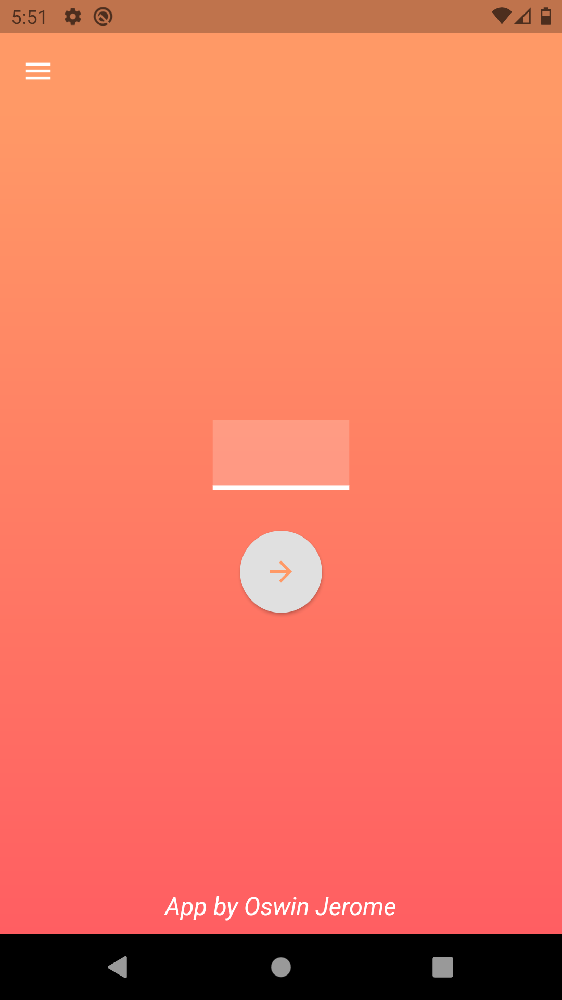
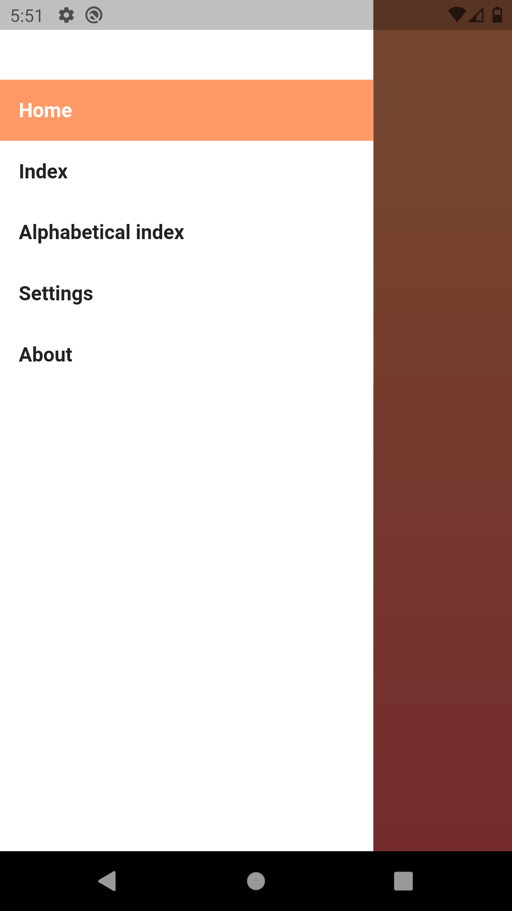
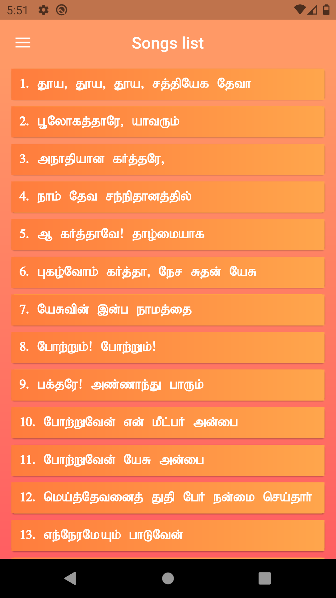
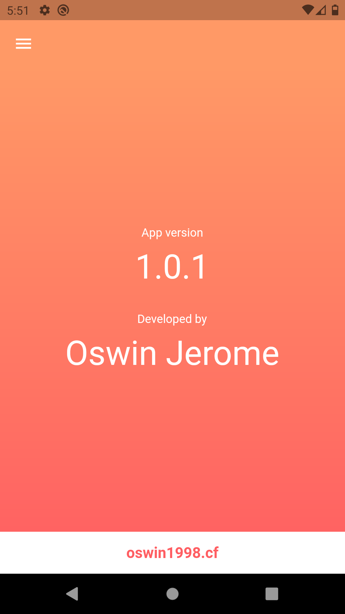

%Songs of Zion
<html lang="en">
<head>
<meta charset="UTF-8">
<meta name="viewport" content="width=device-width, initial-scale=1.0">
<title>Songs of zion</title>
<link rel="stylesheet" href="https://stackpath.bootstrapcdn.com/bootstrap/4.4.1/css/bootstrap.min.css" integrity="sha384-Vkoo8x4CGsO3+Hhxv8T/Q5PaXtkKtu6ug5TOeNV6gBiFeWPGFN9MuhOf23Q9Ifjh" crossorigin="anonymous">
</head>
<body>

<h1 class="mt-5 text-center heading text-muted">Songs of Zion (v1.0.1)</h1>
<h6>by <a href="https://oswin1998.cf/">Oswin Jerome</a></h6>
<a href="./app-release.apk" class="btn btn-success mt-4">Download</a>

            

                
            

            

                
            

            

                
            

            

                
            

        

</body>
</html>